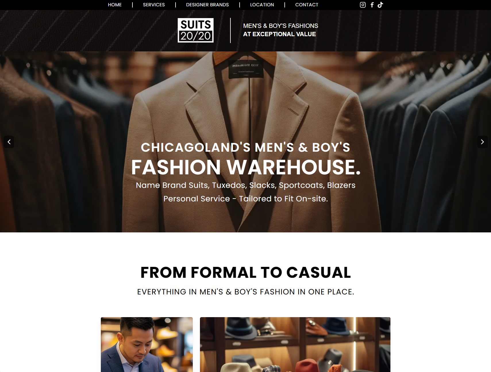
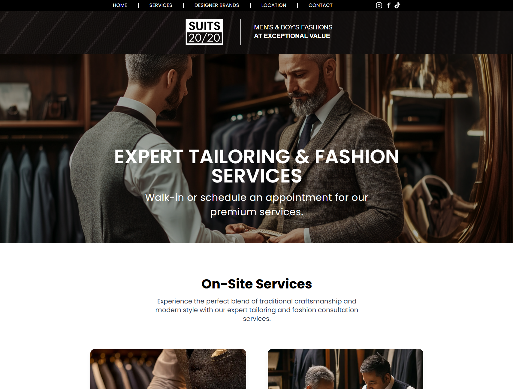
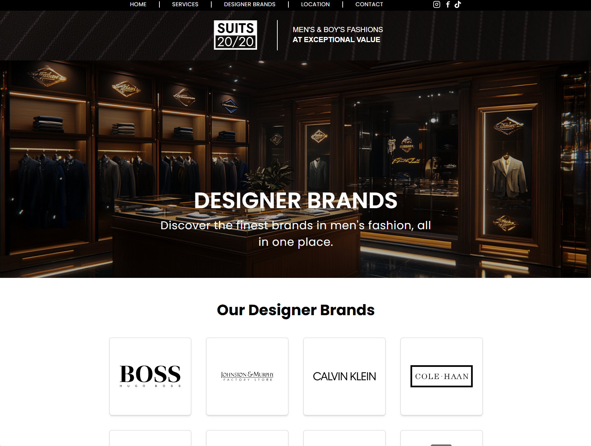
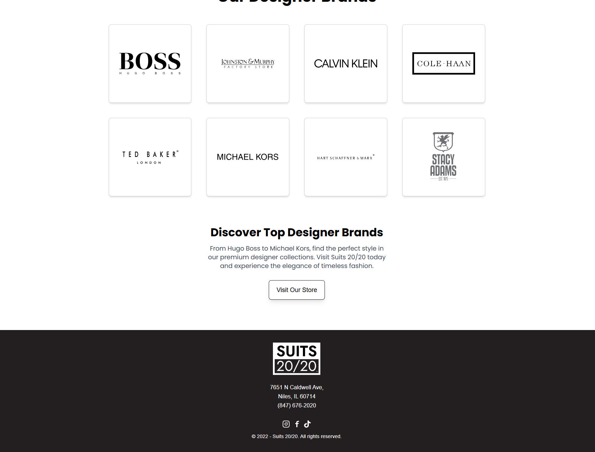
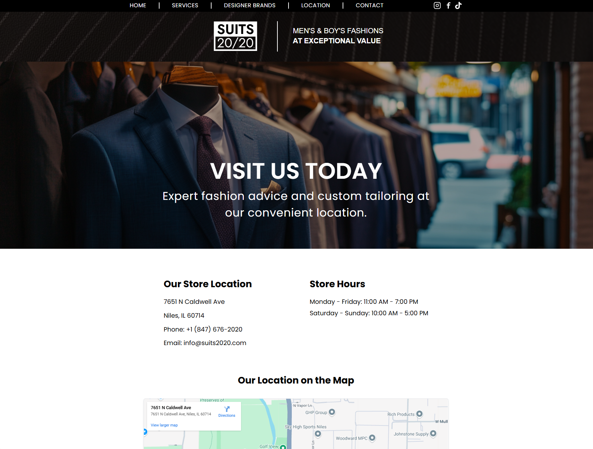
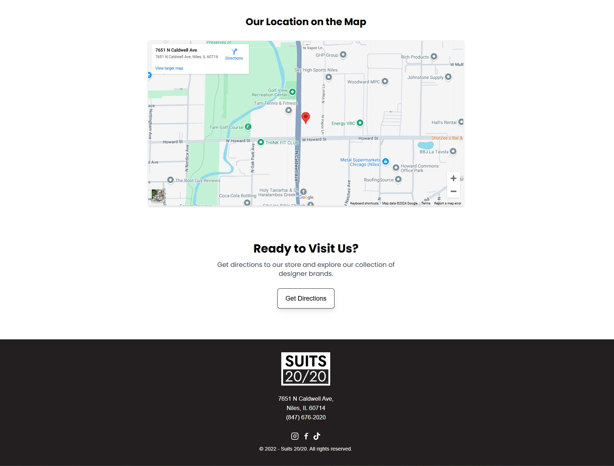
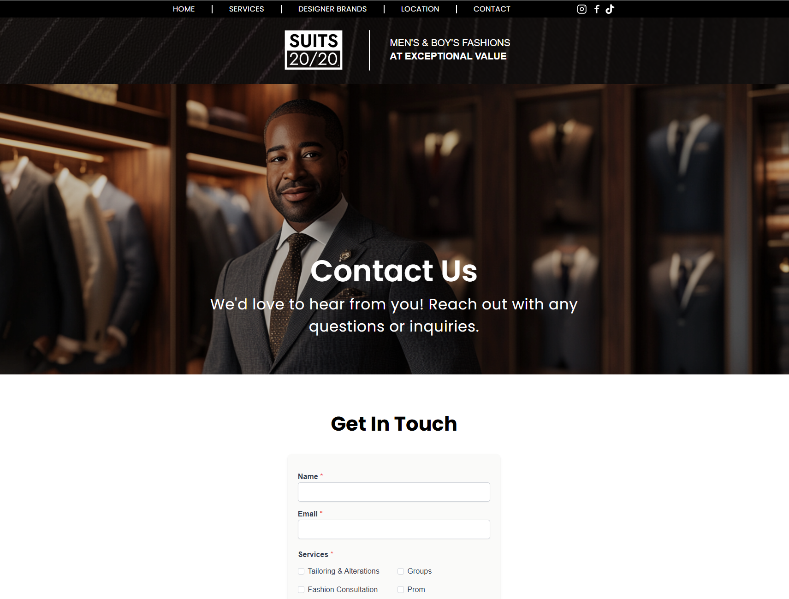
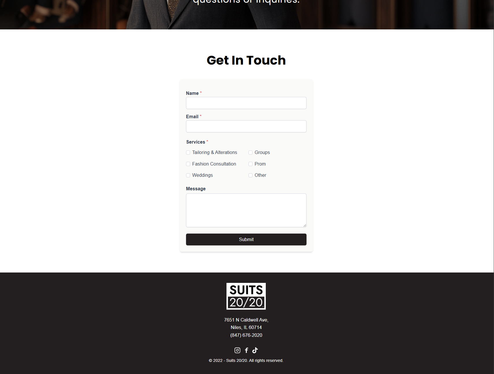

# Suits 20/20 - Client Website

Premium men's fashion website showcasing designer brands, expert tailoring services, and store information.

## Overview

Suits 20/20 offers expert tailoring services, premium designer brands, and personalized fashion consulting in Niles, IL. Our website provides a seamless experience for customers to explore our services, brands, and location details.

## Features

- Designer Brands Showcase: Highlighting premium brands like Hugo Boss, Michael Kors, Ted Baker, and more.
- Expert Tailoring Services: Comprehensive tailoring and alteration options.
- Store Location: Includes an interactive map for easy navigation.
- Contact Form: Integrated with EmailJS for message submission.
- Responsive Design: Mobile-first, ensuring great UX across all devices.
- SEO & Accessibility Optimized: Includes Schema.org markup and ARIA-compliant features.

## Technologies

- **Framework:** Next.js 15
- **Styling:** TailwindCSS
- **Forms:** Formik + Yup for validation
- **Email Integration:** EmailJS
- **Images:** MidJourney AI-generated images and Next/Image optimization
- **SEO:** Schema.org, OpenGraph, and meta tags for enhanced search visibility

## Pages

- **Home:** Service overview and style offerings
- **Services:** Tailoring and design services
- **Brands:** Premium designer brand showcase
- **Location:** Store details and interactive map
- **Contact:** ARIA-compliant form with live validation

## Setup

### Prerequisites

- Node.js v16+
- PNPM
- EmailJS account

### Installation

```bash
# Clone repository
git clone https://github.com/jclark-14/suits2020.git

# Install dependencies
cd suits2020
pnpm install

# Configure environment variables
# Create .env.local with:
NEXT_PUBLIC_EMAILJS_SERVICE_ID=your_service_id
NEXT_PUBLIC_EMAILJS_TEMPLATE_ID=your_template_id
NEXT_PUBLIC_EMAILJS_PUBLIC_KEY=your_public_key

# Start development server
pnpm dev
```

Future Enhancements
Customer Portal: Add a feature for users to log in and manage their appointments.
Online Appointment Booking: Allow users to schedule tailoring or design consultations online.
E-Commerce: Extend the site to include online shopping for designer products.

### Screenshots

## Home Page




- **Gif**
  

## Services Page




## Designer Brands Page





## Location Page





## Contact Page





Thank you for visiting Suits 20/20! If you have any questions or suggestions, please feel free to reach out.

## Links

- [Visit Suits 20/20 Live](https://suits2020.com)
- [TailwindCSS Documentation](https://tailwindcss.com)
- [EmailJS Integration Guide](https://www.emailjs.com/docs/)
